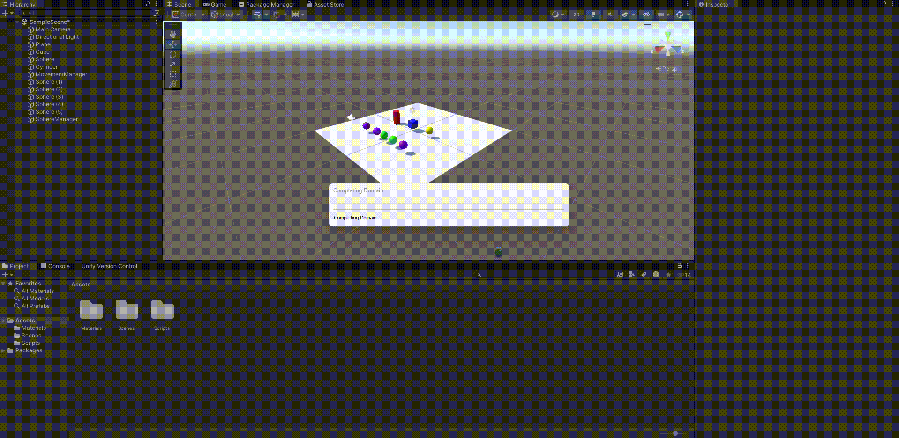

# Practica2_II

En esta practica se han desarrollado 8 scripts. Estos han servido como iniciación en la programación de scripts en C# en Unity. A continuación se describen los ejercicios realizados.

### Ejercicio 1

### Ejercicio 2

### Ejercicio 3

### Ejercicio 4

### Ejercicio 5

### Ejercicio 6

### Ejercicio 7

### Ejercicio 8

