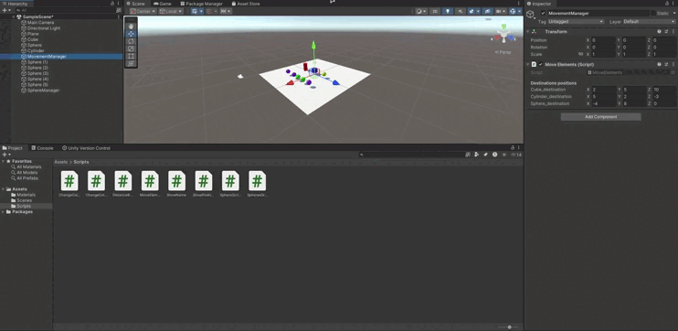

# Practica2_II

En esta practica se han desarrollado 8 scripts. Estos han servido como iniciación en la programación de scripts en C# en Unity. A continuación se describen los ejercicios realizados.

### Ejercicio 1

En este primer script hemos tenido que hacer que el color de los distintos objetos de la escena cambie cada 120 frames, esta tasa de refresco de puede cambiar desde el inspector.

Para esto lo que se ha hecho es crear un Vector3 al cual se le asignan números aleatorios entre 0 y 1, una vez rellenado el vector este se asigna al color del objeto.

```csharp
Vector3 color = new Vector3(Random.Range(0.0f, 1.0f), Random.Range(0.0f, 1.0f), Random.Range(0.0f, 1.0f));
GetComponent<Renderer>().material.color = new Color(color.x, color.y, color.z);
```


### Ejercicio 2

Para resolver lo que nos planteaba este ejercicio se ha desarrollado un script que muestra por consola el nombre del objeto al que se ha asignado dicho script.

```csharp
Debug.Log("Name: " + gameObject.name);
```


### Ejercicio 3

Para realizar script se han creado 2 variables Vector3 públicas para que así puedan ser rellenadas desde el inspector. Se han realizado los siguientes calculos con dichas variables:

- La magnitud de cada una de las variables.
- El ángulo que forman entre ellas.
- La distancia entre ambas.

Además de mostrar todos los resultados anteriores por consola, se muestra tambien cual de las dos variables está a una altura mayor.

Para todo esto se han utilizado métodos de la clase Vector3.


### Ejercicio 4

En este ejercicio se ha creado un script que muestra por pantalla el vector de posición de la esfera. Para esto se ha utilizado la funcion ```GetComponent<Transform>()``` para obtener el componente Transform del objeto y asi poder acceder a la posición.


### Ejercicio 5

Este script se ha desarrollado para conocer la distancia a la que están el cubo y el cilindro de la esfera. Se ha hecho uso de la función ```FindGameObjectWithTag()``` para buscar el cubo y el cilindro y asi poder acceder a su componente Transform con la función ```GetComponent<Transform>()``` y luego acceder a la posición. Para conocer la posición de la esfera basta con utilizar la función ```GetComponent<Transform>()``` puesto que es el objeto al que se le ha asignado el script.


### Ejercicio 6

Para este ejercicio se ha creado un EmptyObject al que se le ha asignado un script que se encarga de realizar mover el cubo, el cilindro y la esfera a las coordenadas especificadas, para conocer estas 3 coordenadas se han creado 3 Vector3 públicos que se rellenan desde el inspector y se asignan a las posiciones de los objetos.



### Ejercicio 7

Este ejercicio se resolvio con un script que hace que el color del cilindro cambie presionando la tecla "Espacio" y que el color del cubo cambie cuando se presiona la tecla "C". Para esto se ha hecho uso de la función ```Input.GetKeyDown()``` para detectar cuando se presiona una tecla. Además para poder utilizar el mismo script para ambos objetos se comprueba que cuando se presione la tecla "Espacio" el objeto sea el cilindro y cuando se presione la tecla "C" el objeto sea el cubo.


### Ejercicio 8

En primer lugar para realizar este ejercicio se han creado 5 nuevas esferas que se dividen en 2 grupos, uno con dos y otro con tres. Además al igual que en el ejercicio 6 se ha creado un EmptyObject al que se le ha asignado un script que se encarga de aumentar la altura de la esfera del grupo 2 más cercana al cubo. Por otro lado también se encarga de cambiar el color de la esfera de cualquiera de los dos grupos que esté más lejana del cubo cuando se presiona la tecla "Espacio".

